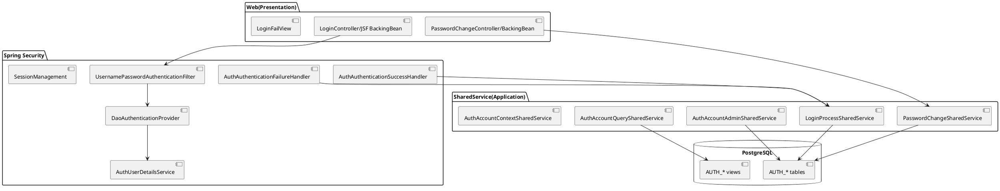
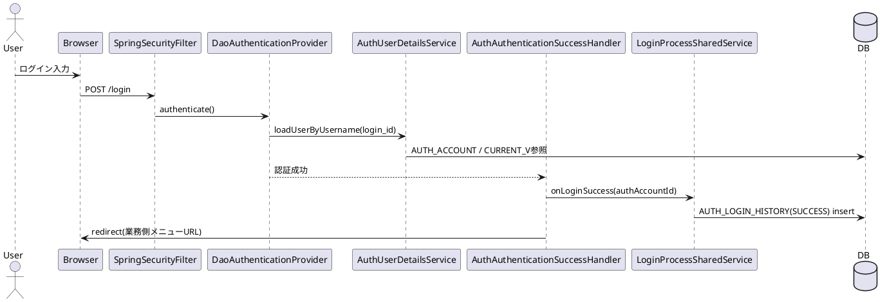

# 基本設計書：AP基盤（認証・認可）【確定版】

- 文書名: 基本設計書（認証・認可：AP基盤）
- 対象: AP基盤チーム（認証コンテキスト）
- 版数: 1.0（確定版）
- 更新日: 2026-01-25
- 参照: 要件定義書 v1.0.2（01_要件定義_認証基盤_v1.0.2.md）

---

## 1. 目的

本書は、要件定義書で確定した認証・認可機能について、画面・処理・DB・外部I/F・セキュリティ構成を基本設計として具体化し、詳細設計・実装・試験へトレース可能にする。

---

## 2. スコープ

- ログイン（成功/失敗、ロック、期限切れ、監査ログ）
- パスワード変更（本人変更）
- 管理者操作（新規登録、初期化、ロック解除、有効/無効、論理削除）※I/F提供（UIは業務側）
- 認証DBスキーマ・VIEW（Query用途）
- 業務チーム向けSharedService（Command/Query/Context）

---

## 3. アーキテクチャ概要


### 3.0 ドメイン駆動設計（DDD）方針（明記）

本プロジェクトは、AP基盤（認証コンテキスト）を **ドメイン駆動設計（DDD）** の考え方で設計・実装することを基本方針とする。  
認証・認可のルール（ロック、期限、パスワードポリシー、状態遷移、履歴/監査）をドメインとして明確化し、業務チームへ一貫したモデルとI/F（SharedService）を提供する。

- 境界づけられたコンテキスト: 認証・認可は「Authコンテキスト」として独立させ、業務側とは SharedService を介して連携する。
- 戦術パターン:
  - Aggregate: `AuthAccount` を集約ルートとする
  - Domain Policy: `PasswordPolicy` / `LockPolicy` / `ExpiryPolicy`
  - Domain Event（履歴）: insert-only の履歴で監査と状態導出を行う
  - Value Object: `AuthAccountId` / `LoginId` / `RoleCode` 等
- 層構造: Presentation → Application → Domain → Infrastructure の依存方向を維持し、Domainは永続化技術に依存しない。

> 以降の設計（画面/I-F/DB/例外/テスト観点）は、本DDD方針に従って記述する。


### 3.1 レイヤ構成（責務分担）

- Presentation（Web/JSF等）: 画面表示・入力受領・メッセージ表示
- Security（Spring Security）: 認証フィルタ、セッション管理、成功/失敗ハンドラ
- Application（SharedService）: ユースケース/トランザクション境界、業務チーム向けI/F
- Domain: ポリシー（LockPolicy/PasswordPolicy）、ドメイン例外、値オブジェクト
- Infrastructure（MyBatis）: DBアクセス（Mapper）、VIEW参照、監査ログ出力

> クラス構成のベースは「AP基盤のクラス構成.md」を踏襲し、認証コンテキストのパッケージを分離する。

### 3.2 コンポーネント構成（論理）



---

## 4. 画面基本設計

### 4.1 画面一覧

| 画面ID | 画面名 | URL | メソッド | 認証要否 | 対応要件 |
|---|---|---|---|---|---|
| SCR-LOGIN | ログイン | `/login` | GET | 不要 | SR-LOGIN-001/002 |
| SCR-LOGIN (POST) | ログイン送信 | `/login` | POST | 不要 | FR-LOGIN-001/002 |
| SCR-LOGIN-FAILURE | ログイン失敗 | `/login/fail` | GET | 不要 | SR-LOGIN-003, FR-LOGIN-004 |
| SCR-PWD-CHG | パスワード変更 | `/account/password/change` | GET/POST | 要 | FR-PWD-001〜007, SR-PWD-001/002 |
| SCR-PWD-CHG-COMP | パスワード変更完了 | `/account/password/change/complete`（仮） | GET | 要 | SR-PWD-003 |

> 注: パスワード変更URLは要件で `/account/password/change` と確定している（スペル含む）。完了画面URLは詳細設計で最終確定する。

### 4.2 画面遷移

- ログイン成功 → 業務側メニュー画面（遷移先は業務側定義）
- ログイン失敗 → ログイン失敗画面（SCR-LOGIN-FAILURE）
- パスワード変更成功 → パスワード変更完了画面

```plantuml
@startuml
[*] --> SCR-LOGIN
SCR-LOGIN --> Menu : 認証成功
(業務側URL)
SCR-LOGIN --> SCR-LOGIN-FAILURE : 認証失敗
SCR-LOGIN-FAILURE --> SCR-LOGIN : 再ログイン
Menu --> SCR-PWD-CHG : 変更必須判定で誘導(条件あり)
SCR-PWD-CHG --> SCR-PWD-CHG-COMP : 変更成功
SCR-PWD-CHG --> SCR-PWD-CHG : バリデーションエラー
@enduml
```

### 4.3 画面メッセージ方針（要点）

### 4.4 画面項目定義（概要）

#### 4.4.1 SCR-LOGIN（ログイン）

| 項目ID | 項目名 | 種別 | 必須 | 型/桁 | マスク | 備考 |
|---|---|---|---|---|---|---|
| L-01 | ログインID（login_id） | 入力 | 必須 | 文字列（最大桁は詳細設計で確定） | なし | 現状は user_id 値を入力する運用 |
| L-02 | パスワード | 入力 | 必須 | 文字列（最大桁は詳細設計で確定） | あり | クリップボード制御は業務標準に従う |

#### 4.4.2 SCR-LOGIN-FAILURE（ログイン失敗）

| 項目ID | 項目名 | 種別 | 備考 |
|---|---|---|---|
| LF-01 | 失敗メッセージ | 表示 | アカウント存在可否・内部理由を推測できない共通メッセージ |
| LF-02 | 再ログイン導線 | ボタン/リンク | ログイン画面へ遷移 |

#### 4.4.3 SCR-PWD-CHG（パスワード変更）

| 項目ID | 項目名 | 種別 | 必須 | 型/桁 | マスク | 備考 |
|---|---|---|---|---|---|---|
| P-01 | 現在パスワード | 入力 | 必須 | 文字列 | あり | 現在PW照合に使用 |
| P-02 | 新パスワード | 入力 | 必須 | 文字列（12文字以上） | あり | 3種以上ルール、許可記号集合 |
| P-03 | 新パスワード（確認） | 入力 | 必須 | 文字列 | あり | P-02と一致必須 |

#### 4.4.4 SCR-PWD-CHG-COMP（変更完了）

| 項目ID | 項目名 | 種別 | 備考 |
|---|---|---|---|
| PC-01 | 完了メッセージ | 表示 | 変更が完了した旨を表示 |
| PC-02 | 次画面導線 | ボタン/リンク | 業務側メニューへ遷移（URLは業務側定義） |


- ログイン失敗画面では、**アカウントの存在可否を推測できない**共通メッセージを表示する（NFR-SEC-002）。
- ロック/無効/期限切れ等の内部理由は **監査ログにのみ記録**し、画面には原則出さない（例外が必要なら詳細設計で合意）。

---


### 4.8 入力チェック（基本設計レベル）

- 共通
  - 必須チェックはサーバ側で必ず実施する（SR-LOGIN-002）。
  - エラーメッセージはメッセージIDで管理し、画面表示文言は詳細設計で確定する。

- ログイン（SCR-LOGIN）
  - login_id, password の必須のみ（形式・桁は業務側の利用実態を踏まえ詳細設計で確定）。
  - 失敗理由の露出はしない（NFR-SEC-002）。失敗画面は共通メッセージで統一。

- パスワード変更（SCR-PWD-CHG）
  - 現在PW照合（不一致はエラー）
  - 新PWのポリシー（12文字以上、4種のうち3種以上、許可記号集合）を満たすこと
  - 新PWと確認PWが一致すること
  - 直近3世代と同一禁止


### 4.9 メッセージID（ドラフト）

| メッセージID | 対象画面 | 種別 | 内容（要旨） | 備考 |
|---|---|---|---|---|
| MSG-LOGIN-FAILURE-001 | SCR-LOGIN-FAILURE | エラー | ログインに失敗しました。入力内容を確認してください。 | 共通メッセージ（存在可否・理由非開示） |
| MSG-PWD-ERR-001 | SCR-PWD-CHG | エラー | 現在のパスワードが正しくありません。 | |
| MSG-PWD-ERR-002 | SCR-PWD-CHG | エラー | 新しいパスワードがポリシーを満たしていません。 | 詳細理由は必要最小限 |
| MSG-PWD-ERR-003 | SCR-PWD-CHG | エラー | 新しいパスワード（確認）が一致しません。 | |
| MSG-PWD-ERR-004 | SCR-PWD-CHG | エラー | 過去に使用したパスワードは使用できません。 | 直近3世代 |
| MSG-PWD-COMP-001 | SCR-PWD-CHG-COMP | 情報 | パスワード変更が完了しました。 | |


## 5. ユースケース基本設計

### 5.1 ログイン（成功）

1. POST `/login` を Spring Security Filter が受領
2. `DaoAuthenticationProvider.authenticate()` が `AuthUserDetailsService.loadUserByUsername(login_id)` を呼び出し
3. DBより認証アカウントを取得し、状態（disabled/deleted/locked/expired）を評価
4. パスワード照合が成功した場合、成功ハンドラが起動
5. 成功イベントにより `LoginProcessSharedService.onLoginSuccess(authAccountId)` が履歴登録（AUTH_LOGIN_HISTORY: SUCCESS）
6. セッション確立後、業務側メニューへ遷移



### 5.2 ログイン（失敗：アカウント不存在を含む）

- アカウント不存在の場合
  - DBのログイン履歴には記録しない（NFR-OPS-001）
  - 監査ログへ記録する（対象項目は詳細設計で確定）
- アカウントが存在する場合
  - 失敗結果に応じた履歴を記録（FAILURE/LOCKED/DISABLED/DELETED/EXPIRED）
  - FAILの場合は直近失敗回数を評価し、連続6回でLOCKイベントを登録

> 失敗時の画面遷移は **専用失敗画面へ遷移**（U-02決定）。

```plantuml
@startuml
actor User
participant B as Browser
participant F as Filter
participant P as Provider
participant UDS as UserDetailsService
participant FH as FailureHandler
participant LSS as LoginProcessSharedService
database DB

User -> Browser : ログイン入力
Browser -> Filter : POST /login
Filter -> Provider : authenticate()
Provider -> UserDetailsService : loadUserByUsername(login_id)
UserDetailsService -> DB : AUTH_ACCOUNT / CURRENT_V参照
alt アカウント不存在
  Provider --> FailureHandler : 例外(UsernameNotFound等)
  FailureHandler -> LSS : onLoginAttemptNotFound(login_id)
  LSS -> LSS : 監査ログ出力
(DB履歴は残さない)
  FailureHandler -> Browser : redirect(/login/fail)
else アカウント存在
  Provider --> FailureHandler : 例外(BadCredentials/Locked/Disabled/Expired等)
  FailureHandler -> LSS : onLoginFailure(authAccountId, reason)
  LSS -> DB : AUTH_LOGIN_HISTORY insert
(FAILURE/LOCKED/...)
  LSS -> DB : (必要時) LOCK履歴 insert
  FailureHandler -> Browser : redirect(/login/fail)
end
@enduml

#### 5.2.1 失敗理由（内部コード）と画面表示

- 画面（SCR-LOGIN-FAILURE）に表示するメッセージは共通（MSG-LOGIN-FAILURE-001）とし、以下の内部理由は**画面に出さない**（NFR-SEC-002）。
- 内部理由は履歴（DB）および監査ログに記録する（記録先・項目は 9章）。

| 内部理由コード | 想定例外/状態 | DB履歴（AUTH_LOGIN_HISTORY.result） | 失敗カウント対象 | 備考 |
|---|---|---|---|---|
| FAILURE | パスワード不一致（BadCredentials） | FAILURE | 対象 | 連続失敗回数に加算 |
| LOCKED | ロック中 | LOCKED | **対象外** | 要件：ロック中ログインは失敗カウントに含めない |
| DISABLED | 無効（account_status=DISABLED） | DISABLED | 対象外 | |
| DELETED | 論理削除（account_status=DELETED） | DELETED | 対象外 | |
| EXPIRED | 期限切れ（ログイン時判定） | EXPIRED | 対象外 | |
| NOT_FOUND | アカウント不存在 | （DBには残さない） | 対象外 | 監査ログのみ |

#### 5.2.2 ロック判定（連続失敗6回）

- 失敗カウントは **FAILURE のみ**を対象とし、LOCKED/DISABLED/DELETED/EXPIRED/NOT_FOUND は対象外とする。
- 連続失敗回数は「当該アカウントの直近ログイン履歴（AUTH_LOGIN_HISTORY）を新しい順に見て、SUCCESSが出るまでの FAILURE 件数」で導出する。
- 連続失敗回数が `auth.lock.failure-threshold`（=6）に到達した場合、ロックイベントを登録し、以後はロック中として扱う。

**処理順序（失敗時）**
1. 失敗理由判定（FAILURE/LOCKED/…）
2. DBへログイン履歴を insert（NOT_FOUND以外）
3. 失敗理由が FAILURE の場合のみ、直近の連続FAIL数を算出
4. 閾値到達なら `AUTH_ACCOUNT_LOCK_HISTORY` に LOCK（locked=true）を insert（冪等）
5. 次回以降のログインは LOCKED として拒否（履歴 result=LOCKED、カウント対象外）

> 冪等性: 既にロック中の場合に、再度 LOCK を insert しない（直近ロック状態を参照して判定）。

#### 5.2.3 アカウント不存在（NOT_FOUND）時の監査ログ（U-05）

- DB履歴には記録しない（NFR-OPS-001）。
- 監査ログへ以下の最小項目を出力する（詳細は9章で確定）。
  - event=LOGIN_ATTEMPT_NOT_FOUND, login_id（入力値）, ip, userAgent, occurredAt, correlationId
```

### 5.3 期限切れ判定（U-06）


#### 5.3.1 判定根拠
- 最終パスワード変更日時は `AUTH_PASSWORD_HISTORY` の最新レコード（USER_CHANGE/ADMIN_RESET/INITIAL_REGISTER）から取得する。
- 期限切れ判定: `now > lastPasswordChangedAt + auth.password.expiry-days(=90)` の場合に期限切れとする。

#### 5.3.2 EXPIRE履歴登録の扱い（基本設計の方針）
- 期限切れ成立時、ログインは拒否し `AUTH_LOGIN_HISTORY.result=EXPIRED` を記録する。
- `AUTH_ACCOUNT_EXPIRY_HISTORY(EXPIRE)` の登録は **必須ではなく任意**とし、以下の目的で登録する場合に限り実施する。
  - 管理画面等で「期限切れ状態」を履歴イベントとして扱いたい場合
  - 状態導出VIEW（AUTH_ACCOUNT_CURRENT_V）で expiry_history を参照する設計に統一したい場合
- 本プロジェクトでは、要件定義の「expiry_historyで導出」を踏まえ、**期限切れ成立時にEXPIREを冪等登録する**方針を採用する。
  - 既に期限切れ状態（最新がEXPIRE）の場合、重複登録しない。
  - パスワード変更成功時に `UNEXPIRE` を登録する。

- 期限切れは **ログイン時** に「最終PW変更日時 + 90日」で判定する（FR/4.6、NFR方針）。
- 判定は `AuthUserDetailsService` のユーザ読み込み時に実施し、期限切れなら `AccountExpiredException` 等で認証失敗とする。
- 必要に応じて `AUTH_ACCOUNT_EXPIRY_HISTORY` に `EXPIRE` を冪等登録する（登録要否/タイミングは詳細設計で確定）。

### 5.4 パスワード変更（本人）

- GET `/account/password/change` : 入力画面表示
- POST : 現在PW照合 → ポリシー検証 → 履歴検証（直近3世代）→ 更新 → 履歴登録 → 完了画面

```plantuml
@startuml
actor User
participant UI as PwdUI
participant SS as PasswordChangeSharedService
database DB

User -> UI : 画面表示(GET)
User -> UI : 変更要求(POST)
UI -> SS : changePassword(currentPw, newPw)
SS -> DB : AUTH_ACCOUNT 現在PW照合
SS -> SS : PasswordPolicy検証
(12桁/3種/記号集合等)
SS -> DB : AUTH_PASSWORD_HISTORY 直近3世代取得
SS -> DB : AUTH_ACCOUNT 更新(ハッシュ)
SS -> DB : AUTH_PASSWORD_HISTORY insert(USER_CHANGE)
SS -> DB : AUTH_ACCOUNT_EXPIRY_HISTORY insert(UNEXPIRE)
UI <- SS : OK
UI -> User : 完了画面
@enduml
```


### 5.5 パスワード変更必須の誘導

ログイン成功後、以下条件に該当する場合は業務側メニューへ遷移せず、パスワード変更画面（`/account/password/change`）へ誘導する。

| 判定 | 条件（概要） | 根拠 |
|---|---|---|
| 初期登録 | パスワード履歴が存在しない、または INITIAL_REGISTER のみ | 要件定義 5.3 |
| 管理者リセット | 最新のパスワード履歴種別が ADMIN_RESET | 要件定義 5.3 |
| 有効期限切れ | 最終変更日時から 90日超過 | FR-PWD-003/有効期限 |

実現方式（基本設計）:
- 認証成功ハンドラ（AuthAuthenticationSuccessHandler）で `PasswordChangeRequiredSharedService` 相当を呼び出し、必要なら change URL へ redirect する。
- redirect判定は View（CURRENT_V）や履歴取得により実施し、N+1を避ける。

---

## 6. DB基本設計（論理）


> 物理DDLは「02_db_design_ddl_integrated.md」を正とし、本書では論理関係と利用観点を記載する。

### 6.1 テーブル（要点）

- `AUTH_ACCOUNT`（現在値）
- `AUTH_ROLE`, `AUTH_ACCOUNT_ROLE`（N:M）
- insert-only 履歴
  - `AUTH_PASSWORD_HISTORY`
  - `AUTH_LOGIN_HISTORY`
  - `AUTH_ACCOUNT_LOCK_HISTORY`
  - `AUTH_ACCOUNT_EXPIRY_HISTORY`
  - `AUTH_ACCOUNT_STATUS_HISTORY`

### 6.2 VIEW（Query用途）

- `AUTH_ACCOUNT_CURRENT_V`
  - `AUTH_ACCOUNT` を起点に最新のロック状態・期限状態・前回ログイン日時を導出
- `AUTH_ACCOUNT_ROLE_V`
  - アカウントに紐づく `role_code` を行形式で提供（一覧用）

> VIEWの最新行取得方式は PostgreSQL では `DISTINCT ON`、H2では `row_number()` を用いる。採用方法（テスト用VIEWを別途用意するか、Mapper SQLで吸収するか）は 6.7 で整理し、詳細設計で確定する。

### 6.3 インデックス（基本方針）

- 履歴の「最新取得」を高速化する複合インデックス
  - 例：`(auth_account_id, occurred_at DESC, <pk> DESC)` 系
- login_id の一意制約（要件で別概念だが現状 user_id 値を使用）

---


### 6.4 主キー・一意制約・参照制約（概要）

- 主キー
  - すべてのテーブルはサロゲートキー（`*_id`）を主キーとする。
  - 履歴テーブルは insert-only のため、更新は行わない。

- 一意制約
  - `AUTH_ACCOUNT.login_id` は一意（ユニーク）とする（現状運用では user_id 値だが、概念としては別）。
  - `AUTH_ROLE.role_code` は一意とする。
  - `AUTH_ACCOUNT_ROLE` は `(auth_account_id, role_code)` の複合一意とする。

- 参照制約（外部キー）
  - `AUTH_ACCOUNT_ROLE.auth_account_id` → `AUTH_ACCOUNT.auth_account_id`
  - `AUTH_ACCOUNT_ROLE.role_code` → `AUTH_ROLE.role_code`
  - 各履歴テーブルの `auth_account_id` → `AUTH_ACCOUNT.auth_account_id`

> 外部キーのON DELETE方針は、論理削除（DELETED）前提のため原則 `RESTRICT` とする（物理削除しない）。

### 6.5 インデックス設計（基本方針）

#### 6.5.1 ログイン検索（login_id）
- `AUTH_ACCOUNT(login_id)`：ユニークインデックス（認証時の最初の特定キー）

#### 6.5.2 「最新履歴」取得（CURRENT_V向け）
履歴から「最新行」を高速に取得するため、以下の複合インデックスを付与する。

- `AUTH_LOGIN_HISTORY(auth_account_id, login_at DESC, auth_login_history_id DESC)`
- `AUTH_ACCOUNT_LOCK_HISTORY(auth_account_id, occurred_at DESC, auth_account_lock_history_id DESC)`
- `AUTH_ACCOUNT_EXPIRY_HISTORY(auth_account_id, occurred_at DESC, auth_account_expiry_history_id DESC)`
- `AUTH_PASSWORD_HISTORY(auth_account_id, changed_at DESC, auth_password_history_id DESC)`
- `AUTH_ACCOUNT_STATUS_HISTORY(auth_account_id, occurred_at DESC, auth_account_status_history_id DESC)`

> 「日時が同一」のケースを想定し、タイブレークとして主キー降順を併用する。

#### 6.5.3 一覧検索（業務側管理画面向け）
- `AUTH_ACCOUNT(account_status)`：状態別抽出
- `AUTH_ACCOUNT(created_at)`：新規登録順
- 必要に応じて `AUTH_ACCOUNT(login_id)` の前方一致検索に備え、B-Treeで対応（全文検索は対象外）

### 6.6 VIEW設計（詳細）

#### 6.6.1 AUTH_ACCOUNT_CURRENT_V（現在状態導出）

- 目的
  - Query sharedService が、ロック・期限切れ・前回ログイン日時を1回の参照で取得できるようにする。
- 導出項目（例）
  - `locked`：ロック履歴の最新 `locked` 値
  - `expired`：期限履歴の最新 `event_type` が EXPIRE か
  - `last_login_at`：ログイン履歴の最新 SUCCESS の `login_at`

- 取得方式（PostgreSQL / H2 の差分吸収）
  - PostgreSQL: `DISTINCT ON (auth_account_id)` により最新行を抽出
  - H2: `row_number() over(partition by auth_account_id order by occurred_at desc, <pk> desc)` を用いて rn=1 を抽出

> 実装方式: VIEWをDB毎に2種類持たず、MyBatisのSQLで「最新取得」を行う方式でも良い。  
> ただし、本プロジェクトでは Query sharedService の安定性を優先し、VIEWで吸収する方針を採用する（H2互換VIEWを別途用意するか、テスト時はSQL差し替えで吸収するかを詳細設計で確定）。

#### 6.6.2 AUTH_ACCOUNT_ROLE_V（行形式）

- 目的
  - アカウント一覧に対し、IN句でロールを一括取得しN+1を回避する。
- 形式
  - `(auth_account_id, role_code)` の行を返す単純VIEWとする。

### 6.7 DB方言差（PostgreSQL / H2）対応方針

- 方針
  - 本番: PostgreSQL
  - テスト: H2（PostgreSQL互換モード）
- 差異が出やすいポイント
  - `DISTINCT ON`（PostgreSQL固有）
  - `BOOLEAN`/`TIMESTAMP` の扱い
  - `IDENTITY`/シーケンスの定義
- 対応
  1. VIEWをDB別に切り替える（推奨：テスト用DDLでrow_number版VIEWを作成）
  2. VIEWを使わずMapper SQLで吸収（テスト用設定でSQL差替）

詳細設計では、実際のDDL（`02_db_design_ddl_integrated.md`）とテストスキーマ（H2）を照合し、採用方式を確定する。


## 7. 外部I/F基本設計（SharedService）

本章は、業務チームへ提供する認証・認可の処理部品（SharedService）のI/Fを、DDDの層構造（Application層）として定義する。  
I/Fは「Command（状態変更）」と「Query（参照）」を分離し、ドメイン例外はアプリケーション例外へマッピングして返却する。

### 7.1 I/F一覧（要件IR対応）

| 種別 | I/F | 目的 | 呼出主体 | トランザクション | 対応要件 |
|---|---|---|---|---|---|
| Query | `AuthAccountQuerySharedService` | 現在状態/ロール/一覧検索 | 業務側（画面/バッチ） | READ-ONLY | IR-SHARED-001/002 |
| Command | `AuthAccountAdminSharedService` | 登録/初期化/ロック解除/有効無効/削除 | 業務側（管理画面） | REQUIRED | IR-SHARED-003/004 |
| Context | `AuthAccountContextSharedService` | ログイン中アカウント取得 | 業務側（画面） | READ-ONLY | IR-SHARED-001 |
| Usecase | `LoginProcessSharedService` | 認証成功/失敗の履歴・監査・ロック判定 | Securityハンドラ | REQUIRED | FR-LOGIN-* |
| Usecase | `PasswordChangeSharedService` | 本人変更、履歴、期限解除 | 業務側（画面） | REQUIRED | FR-PWD-* |

> 注: `LoginProcessSharedService` は業務側から直接呼ばれず、Spring Securityの成功/失敗ハンドラからのみ呼ばれる想定。

### 7.2 DTO（データ構造）方針

- Queryは用途ごとにDTOを分け、Entity（DBモデル）を外部へ露出しない。
- Commandは入力DTOを使用し、値オブジェクト（LoginId/RoleCode等）に変換してドメインへ渡す。
- 日時は `Instant`/`LocalDateTime` を採用し、タイムゾーンはアプリ基準（JST）で統一する（詳細は共通基盤方針に従う）。

#### 7.2.1 代表DTO（案）

```java
public record AuthAccountSummaryDto(
    Long authAccountId,
    String loginId,
    String accountStatus,
    boolean locked,
    boolean expired,
    java.time.Instant lastLoginAt
) {}

public record AuthAccountDetailDto(
    Long authAccountId,
    String loginId,
    String accountStatus,
    java.util.Set<String> roleCodes,
    boolean locked,
    boolean expired,
    java.time.Instant lastLoginAt,
    java.time.Instant createdAt,
    String createdBy
) {}

public record RegisterAccountCommand(
    String loginId,
    java.util.Set<String> roleCodes
) {}
```

### 7.3 例外体系（共通）

Application層のSharedServiceは、業務側が扱いやすい例外へ統一する。

| 例外 | 意味 | 主な発生契機 | 業務側ハンドリング |
|---|---|---|---|
| `NotFoundException` | 対象が存在しない | authAccountId不正 | 404/画面エラー |
| `ValidationException` | 入力不備 | 必須/形式/桁 | 入力エラー表示 |
| `PolicyViolationException` | ポリシー違反 | PWポリシー/過去3世代 | 入力エラー表示 |
| `ConflictException` | 競合 | login_id重複、同時更新 | 再試行/メッセージ |
| `PermissionDeniedException` | 権限不足 | 管理操作の権限不備 | 403 |

> 認証（ログイン）の失敗は、画面に例外詳細を出さず、SecurityのFailureHandlerで共通メッセージへ遷移する。

### 7.4 トランザクション境界（基本）

- Command/Usecase系は `@Transactional(REQUIRED)` を基本とする。
- Query系は `@Transactional(readOnly=true)` を基本とする。
- ログイン成功/失敗の履歴登録は、認証処理の結果に従い **必ず記録**する（ただし NOT_FOUND は監査ログのみ）。

### 7.5 I/F仕様（シグネチャ：確定候補）

#### 7.5.1 Query

```java
public interface AuthAccountQuerySharedService {
  AuthAccountDetailDto findById(Long authAccountId);
  AuthAccountDetailDto findByLoginId(String loginId);
  java.util.List<AuthAccountSummaryDto> search(String loginIdPrefix, String accountStatus, int limit, int offset);
  java.util.Set<String> findRoleCodes(Long authAccountId);
}
```

- `findByLoginId` は、運用上 login_id の検索が必要な管理画面向け。
- `search` は N+1 回避のため、`AUTH_ACCOUNT_CURRENT_V` と `AUTH_ACCOUNT_ROLE_V` を組み合わせて取得する（実装は詳細設計）。

#### 7.5.2 Command（管理者操作）

```java
public interface AuthAccountAdminSharedService {
  Long registerAccount(RegisterAccountCommand command); // return authAccountId
  void resetPassword(Long authAccountId);               // 初期PWハッシュを設定、ロック解除も同時
  void unlockAccount(Long authAccountId);
  void disableAccount(Long authAccountId);
  void enableAccount(Long authAccountId);               // 必要に応じて期限解除を含む
  void deleteAccount(Long authAccountId);               // 論理削除
  void grantRoles(Long authAccountId, java.util.Set<String> roleCodes);
  void revokeRoles(Long authAccountId, java.util.Set<String> roleCodes);
}
```

- registerAccount:
  - login_id 重複は `ConflictException`
  - 初期PWは **ハッシュ化済み値**（auth.initial-password-hash）を設定（NFR-OPS-002）
  - `AUTH_PASSWORD_HISTORY` に `INITIAL_REGISTER` を登録
- resetPassword:
  - 初期PWハッシュに戻す
  - ロック解除（最新ロックがtrueならUNLOCK相当の履歴登録）
  - `AUTH_PASSWORD_HISTORY` に `ADMIN_RESET` を登録

#### 7.5.3 Context

```java
public interface AuthAccountContextSharedService {
  Long currentAuthAccountId();
  String currentLoginId();
  java.util.Set<String> currentRoleCodes();
}
```

#### 7.5.4 Login Process（Securityハンドラ専用）

```java
public enum LoginFailureReason {
  FAILURE, LOCKED, DISABLED, DELETED, EXPIRED
}

public interface LoginProcessSharedService {
  void onLoginSuccess(Long authAccountId);
  void onLoginFailure(Long authAccountId, LoginFailureReason reason);
  void onLoginAttemptNotFound(String loginId); // 監査ログのみ
}
```

- onLoginFailure:
  - reason=FAILURE のみ失敗カウント対象（連続6回でロック）
  - `AUTH_LOGIN_HISTORY` に result を登録（FAILURE/LOCKED/...）

#### 7.5.5 Password Change（本人変更）

```java
public interface PasswordChangeSharedService {
  void changePassword(Long authAccountId, String currentPassword, String newPassword, String newPasswordConfirm);
}
```

- newPasswordConfirm は Presentation側で突合できるが、二重化防止のためSharedServiceでも検証して良い（詳細設計で決定）。
- 成功時:
  - `AUTH_ACCOUNT` 更新（ハッシュ）
  - `AUTH_PASSWORD_HISTORY(USER_CHANGE)` 登録
  - `AUTH_ACCOUNT_EXPIRY_HISTORY(UNEXPIRE)` 登録

### 7.6 監査（operated_by）と認可

- 管理者操作は `operated_by` を必須とし、ContextSharedServiceから取得する（または呼出側から明示指定）。
- 認可（管理者権限の判定）は、業務側の画面制御に加え、SharedService側でも `PermissionDeniedException` として防御的に実施する（詳細設計で権限体系を確定）。


## 8. セキュリティ基本設計

本章は、要件（NFR-SEC/NFR-SESSION）に基づき、Spring Security による認証・セッション管理・画面遷移・保護機構を基本設計として確定する。

### 8.1 認証方式（form login）

- 認証方式: form login（ユーザ名=login_id、パスワード=password）
- login page: `/login`（GET）
- login processing URL: `/login`（POST）
- 失敗遷移: `/login/fail`（GET）
- 成功遷移:
  - パスワード変更必須なら `/account/password/change`
  - それ以外は業務側メニュー（遷移先は業務側定義）

#### 8.1.1 パラメータ名

| 項目 | 値 |
|---|---|
| usernameParameter | `login_id` |
| passwordParameter | `password` |

> HTMLフォームのname属性と一致させる。

### 8.2 認証プロバイダ／UserDetails

- `DaoAuthenticationProvider` を採用し、`UserDetailsService` によりDBからユーザ情報をロードする。
- `AuthUserDetailsService#loadUserByUsername(loginId)` は、`AUTH_ACCOUNT` と最新状態（CURRENT_V相当）を参照し、以下を評価する。
  - account_status（ACTIVE/DISABLED/DELETED）
  - locked（ロック履歴の最新）
  - expired（ログイン時判定 + 期限履歴の最新）
- 権限（GrantedAuthority）は `role_code` を `ROLE_<CODE>` 形式で付与する。

#### 8.2.1 期限切れ判定の実装ポイント（U-06）
- ロード時に `lastPasswordChangedAt` を取得し、`now > lastPasswordChangedAt + 90日` の場合は期限切れとして扱う。
- 期限切れ成立時は `AccountExpiredException` 相当を送出し、FailureHandlerへ委譲する。
- EXPIRE履歴の冪等登録は `LoginProcessSharedService.onLoginFailure(..., EXPIRED)` の内部で実施する（詳細設計で確定）。

### 8.3 成功ハンドラ／失敗ハンドラ

#### 8.3.1 成功ハンドラ（AuthAuthenticationSuccessHandler）

- 役割
  - `LoginProcessSharedService.onLoginSuccess(authAccountId)` を呼び出し、DB履歴・監査ログを記録する
  - パスワード変更必須判定（5.5）を実施し、必要なら変更画面へリダイレクトする
  - それ以外は業務側メニューへリダイレクトする

- 画面遷移（優先順位）
  1. パスワード変更必須 → `/account/password/change`
  2. それ以外 → 業務側メニューURL（設定値 `auth.post-login-success-url` 等で注入。詳細設計で確定）

#### 8.3.2 失敗ハンドラ（AuthAuthenticationFailureHandler）

- 役割
  - 例外種別を `LoginFailureReason`（FAILURE/LOCKED/DISABLED/DELETED/EXPIRED/NOT_FOUND）へマッピング
  - アカウント不存在（NOT_FOUND）は DB履歴へ残さず監査ログのみ（NFR-OPS-001）
  - その他は `LoginProcessSharedService.onLoginFailure(authAccountId, reason)` を呼び出し、履歴・ロック判定を行う
  - 画面遷移は常に `/login/fail`（共通メッセージ）へ統一

- 例外→理由のマッピング（例）
  - `BadCredentialsException` → FAILURE
  - `LockedException` → LOCKED
  - `DisabledException` → DISABLED
  - `AccountExpiredException` → EXPIRED
  - `UsernameNotFoundException` → NOT_FOUND
  - `InternalAuthenticationServiceException`（NotFound隠蔽用）→ NOT_FOUND（監査のみ）

### 8.4 セッション管理（要件反映：NFR-SESSION）

- 無操作タイムアウト: 30分（`server.servlet.session.timeout=30m`）
- 絶対タイムアウト: 12時間
  - 実現方式（基本設計）: セッション作成時刻を属性に保持し、リクエスト毎に経過時間を評価して超過時は強制ログアウト
- 同時ログイン: 最大1（後勝ち）
  - `maximumSessions(1)` + `maxSessionsPreventsLogin(false)`
  - 失効通知は画面メッセージ（詳細設計）で扱う
- セッション固定化対策: `sessionFixation().migrateSession()`

### 8.5 CSRF / CORS

- CSRF: 有効（ログインPOST、パスワード変更POST、管理操作のPOST/PUT/DELETEを保護）
- CORS: 原則無効（同一オリジン前提）。必要な場合は業務側構成に合わせ、許可オリジンをホワイトリストで設定（詳細設計）。

### 8.6 Authorization（認可）

- URL単位の認可
  - `/account/password/**` は認証済みユーザのみ
  - `/login/**` は匿名可
- 業務側管理画面については業務側のURL体系に依存するため、本AP基盤では SharedService（Command）の呼出時に防御的に権限チェックを行う（7.6）。
- ロール→権限の割当（ROLE_CODE体系）は詳細設計で確定。

### 8.7 監査ログ連携

- 監査ログは FailureHandler/SuccessHandler/SharedService で発生させる。
- correlationId は Filter で生成/伝播し、監査ログ項目に必ず含める（9.2）。
- 監査ログの出力先（ログ基盤）は運用基盤に従う（JSON推奨）。

### 8.8 Spring Security 設定（構成クラス案）

```java
@Configuration
@EnableWebSecurity
public class SecurityConfig {

  @Bean
  SecurityFilterChain filterChain(HttpSecurity http,
                                  AuthenticationSuccessHandler successHandler,
                                  AuthenticationFailureHandler failureHandler) throws Exception {

    http
      .csrf(csrf -> csrf.enable())
      .authorizeHttpRequests(auth -> auth
        .requestMatchers("/login", "/login/**").permitAll()
        .requestMatchers("/account/password/**").authenticated()
        .anyRequest().authenticated()
      )
      .formLogin(form -> form
        .loginPage("/login")
        .loginProcessingUrl("/login")
        .usernameParameter("login_id")
        .passwordParameter("password")
        .successHandler(successHandler)
        .failureHandler(failureHandler)
        .permitAll()
      )
      .sessionManagement(sess -> sess
        .sessionFixation(sessionFixation -> sessionFixation.migrateSession())
        .maximumSessions(1)
        .maxSessionsPreventsLogin(false)
      )
      .logout(logout -> logout
        .logoutUrl("/logout")
        .logoutSuccessUrl("/login")
      );

    return http.build();
  }
}
```

> 絶対タイムアウトのFilter/Interceptor実装、成功時遷移先（業務メニューURL）の注入方式は詳細設計で確定する。


## 9. 監査ログ（運用ログ）基本設計

本章は、要件（NFR-OPS-001、NFR-OPS-002、IR-SHARED-004）に基づき、監査ログのイベント・項目・出力方針を定義する。  
監査ログは「誰が・いつ・何を・どこから（IP/UA）・結果」を追跡可能にすることを目的とし、**個人情報・認証情報の過剰記録を避ける**。

### 9.1 監査ログイベント一覧（確定候補）

| event | 発生契機 | 記録方針 | 主な利用 |
|---|---|---|---|
| LOGIN_ATTEMPT_NOT_FOUND | アカウント不存在のログイン試行 | 監査ログのみ（DB履歴なし） | 侵入兆候（ID列挙）検知 |
| LOGIN_FAILURE | アカウント存在の認証失敗 | 監査ログ＋DB履歴 | 失敗分析、ロック監査 |
| LOGIN_SUCCESS | ログイン成功 | 監査ログ（出力はプロパティ制御・既定OFF）＋DB履歴 | 追跡/監査（必要時のみ有効化） |
| PASSWORD_CHANGED | 本人変更成功 | 監査ログ＋DB履歴 | 不正変更追跡 |
| ADMIN_CREATE_ACCOUNT | 管理者による登録 | 監査ログ＋DB履歴 | 監査 |
| ADMIN_RESET_PASSWORD | 管理者による初期化 | 監査ログ＋DB履歴 | 監査 |
| ADMIN_UNLOCK | 管理者によるロック解除 | 監査ログ＋DB履歴 | 監査 |
| ADMIN_STATUS_CHANGE | 管理者による無効化 | 監査ログ＋DB履歴 | 監査 |
| ADMIN_STATUS_CHANGE | 管理者による有効化 | 監査ログ＋DB履歴 | 監査 |
| ADMIN_STATUS_CHANGE | 管理者による論理削除 | 監査ログ＋DB履歴 | 監査 |
| ROLE_GRANT / ROLE_REVOKE | ロール付与/剥奪 | 監査ログ＋DB履歴 | 権限変更監査 |

> LOGIN_SUCCESS の監査ログ出力は、ログ量・運用要求により抑制する場合がある（詳細設計で決定）。DB履歴は記録する。

### 9.2 監査ログ項目（JSON・構造化ログ推奨）

#### 9.2.1 共通項目（全イベント）

| 項目 | 必須 | 説明 |
|---|---|---|
| occurredAt | 必須 | 発生日時（ISO8601） |
| event | 必須 | イベント名 |
| correlationId | 必須 | リクエスト相関ID（Filterで生成/伝播） |
| ip | 必須 | クライアントIP（X-Forwarded-For対応は詳細設計） |
| userAgent | 任意 | ユーザエージェント |
| authAccountId | 任意 | 対象アカウントID（存在する場合） |
| operatedBy | 任意 | 操作者loginId（= user_id）。管理者操作のみ必須（PII取扱いは運用で統制） |
| result | 任意 | 成否（SUCCESS/FAILURE 等） |
| reason | 任意 | 失敗理由（FAILURE/LOCKED/DISABLED/DELETED/EXPIRED/NOT_FOUND） |

#### 9.2.2 イベント別追加項目（例）

- LOGIN_ATTEMPT_NOT_FOUND
  - loginId（入力値）: 必須（ただしマスキング/ハッシュ化方針は 9.3）
- LOGIN_FAILURE / LOGIN_SUCCESS
  - loginId: 任意（必要な場合のみ。基本は authAccountId を優先）
- ADMIN_* / ROLE_*
  - targetAuthAccountId: 必須
  - roleCodes: 任意（ロール変更のみ）

### 9.3 マスキング・機微情報の取扱い

- **パスワード（平文）**: いかなるログにも出力しない（厳禁）
- loginId（入力値）の取扱い:
  - アカウント不存在（NOT_FOUND）の監査ログでは、侵入兆候分析のため loginId を記録する
  - ただし個人情報に該当し得るため、以下のいずれかの方式で運用する（詳細設計で確定）
    1. マスキング（例: 先頭2文字＋末尾2文字のみ）
    2. HMAC等の不可逆ハッシュ（同一入力の相関のみ可能）
- IP/UA: 監査目的で記録する（保管期間・閲覧権限は運用設計で定義）

### 9.4 出力先・保管・閲覧（運用設計への引継ぎ）

- 出力先: アプリケーションログ基盤（例: CloudWatch Logs / ELK / Loki 等）
- 保管期間: セキュリティ運用要件に従う（例: 1年）※運用設計で確定
- 閲覧権限: 最小権限（運用/監査のみ）。開発者の恒常閲覧は避ける。
- フォーマット: JSON（1イベント1行）を推奨

### 9.5 実装責務（発生箇所）

| 箇所 | 役割 |
|---|---|
| Filter | correlationId生成/伝播、IP抽出 |
| SuccessHandler | LOGIN_SUCCESS 監査ログ、onLoginSuccess呼出 |
| FailureHandler | LOGIN_* 監査ログ、onLoginFailure/onLoginAttemptNotFound呼出 |
| SharedService（Admin） | ADMIN_* / ROLE_* 監査ログ、operatedBy記録 |
| SharedService（Pwd） | PASSWORD_CHANGED 監査ログ |


## 10. 設定項目（プロパティ）

本章は、認証基盤が参照する設定値を一覧化し、環境差分（開発/IT/本番）を安全に管理できるようにする。  
機微情報（初期パスワードハッシュ等）は、設定ファイル直書きではなく機密管理基盤（Secrets Manager等）で注入する。

### 10.1 一覧（精査版）

| キー | 例/デフォルト | 種別 | 決定 | 説明 |
|---|---|---|---|---|
| auth.initial-password-hash | `$2a$...` | 機微 | 決定 | 固定初期PWのハッシュ値（平文は保持しない） |
| auth.post-login-success-url | `/menu` | 通常 | 未決定 | ログイン成功後の業務側メニューURL（環境差分あり） |
| auth.password.expiry-days | 90 | 通常 | 決定 | PW有効期限（日） |
| auth.lock.failure-threshold | 6 | 通常 | 決定 | 連続失敗回数（FAILUREのみカウント） |
| server.servlet.session.timeout | 30m | 通常 | 決定 | 無操作タイムアウト |
| auth.session.absolute-timeout-hours | 12 | 通常 | 決定 | 絶対タイムアウト（時間） |
| auth.session.max-sessions | 1 | 通常 | 決定 | 同時ログイン上限（後勝ち） |
| auth.security.role-prefix | `ROLE_` | 通常 | 決定 | GrantedAuthorityの付与プレフィックス |
| auth.audit.success.enabled | true/false | 通常 | 未決定 | LOGIN_SUCCESS監査ログ出力の有無（ログ量次第） |
| auth.audit.loginId.mode | `mask` / `hmac` | 通常 | 未決定 | NOT_FOUND監査ログのloginId記録方式 |
| auth.audit.loginId.hmac-secret | `***` | 機微 | 未決定 | HMAC秘密鍵（mode=hmac時） |
| auth.audit.loginId.mask.prefix-len | 2 | 通常 | 未決定 | マスキング方式：先頭保持文字数（mode=mask時） |
| auth.audit.loginId.mask.suffix-len | 2 | 通常 | 未決定 | マスキング方式：末尾保持文字数（mode=mask時） |
| auth.web.forwarded-header.enabled | true/false | 通常 | 未決定 | X-Forwarded-For等のForwardedHeader対応有無（LB配下前提ならtrue） |
| auth.web.correlation-id.header | `X-Correlation-Id` | 通常 | 未決定 | 相関IDの受入/返却ヘッダ名 |
| auth.web.correlation-id.generate-if-absent | true | 通常 | 未決定 | 相関IDが無い場合に生成するか |
| auth.password.policy.min-length | 12 | 通常 | 決定 | PW最小長 |
| auth.password.policy.min-categories | 3 | 通常 | 決定 | 4種（英大/英小/数字/記号）のうち必要種別数 |
| auth.password.policy.allowed-symbols | `!"#$%&'()*+,-./:;<=>?@[\]^_{{|}}~` | 通常 | 決定 | 許可記号集合（要件の集合） |
| auth.password.history.count | 3 | 通常 | 決定 | 直近世代数（同一禁止） |
| auth.password.encoder | `bcrypt` | 通常 | 未決定 | パスワードハッシュ方式（既定bcrypt） |
| auth.password.encoder.bcrypt-strength | 10 | 通常 | 未決定 | BCrypt強度（コスト） |
| auth.db.view.current.name | `AUTH_ACCOUNT_CURRENT_V` | 通常 | 決定 | 現在状態導出VIEW名（固定） |
| auth.db.view.role.name | `AUTH_ACCOUNT_ROLE_V` | 通常 | 決定 | ロール導出VIEW名（固定） |
| auth.db.dialect | `postgres` / `h2` | 通常 | 未決定 | 方言差吸収の切替（テストで必要なら） |
| auth.feature.expire-history.enabled | true | 通常 | 決定 | 期限切れ成立時にEXPIRE履歴を冪等登録する（5.3.2方針） |
| auth.feature.password-change-required.enabled | true | 通常 | 決定 | ログイン成功後のPW変更必須誘導を有効化 |

### 10.2 管理方針（補足）

- 機微情報（auth.initial-password-hash、HMAC秘密鍵等）は機密管理で管理し、リポジトリへコミットしない。
- 初期PWハッシュ変更時は、運用マニュアルに従い「管理者がユーザへ通知」する（要件）。
- 相関ID・ForwardedHeaderはインフラ構成（LB/プロキシ）に依存するため、環境でON/OFF可能とする。
- パスワードハッシュ方式（bcrypt強度）は性能に影響するため、非機能（応答時間）と合わせて詳細設計で確定する。

> 未決定のキーは、詳細設計で「採用有無」「デフォルト」「環境差分」を確定し、設定定義（config設計）へ反映する。


## 11. 要件トレース（概要）

- FR-LOGIN-* → 5.1/5.2/8.1
- FR-PWD-* → 5.4/10
- SR-* → 4章
- DR-* → 6章
- IR-* → 7章
- NFR-* → 8章/9章/10章

---

## 12. 変更履歴

| 版数 | 日付 | 変更内容 | 作成者 |
|---|---|---|---|
| 0.1 | 2026-01-25 | 初版ドラフト（要件定義v1.0に基づき基本設計の骨格作成） | ChatGPT |
| 0.1.1 | 2026-01-25 | パスワード変更URLのスペル修正（/account/password/change） | ChatGPT |
| 0.2 | 2026-01-25 | 画面仕様を拡充（項目定義/入力チェック/メッセージID草案、完了URLの規定） | ChatGPT |
| 0.3 | 2026-01-25 | ログイン失敗/ロック/期限切れ/監査ログ/変更必須誘導の基本設計を具体化（5章・9章拡充） | ChatGPT |
| 0.3.1 | 2026-01-25 | ログイン失敗結果コードを FAIL→FAILURE に変更 | ChatGPT |
| 0.4 | 2026-01-25 | DB基本設計を具体化（制約/索引/VIEW詳細/PG-H2差分方針） | ChatGPT |
| 0.4.1 | 2026-01-25 | DDD方針を明記（Authコンテキスト、集約/ポリシー/値オブジェクト、層構造） | ChatGPT |
| 0.5 | 2026-01-25 | SharedService I/Fを確定候補まで具体化（DTO/例外/Tx境界/Command-Query分離） | ChatGPT |
| 0.6 | 2026-01-25 | セキュリティ基本設計を具体化（Spring Security設定、成功/失敗ハンドラ、セッション/CSRF/認可） | ChatGPT |
| 0.7 | 2026-01-25 | 監査ログ/設定項目を具体化（イベント・項目・マスキング方針・機微情報管理） | ChatGPT |
| 0.7.1 | 2026-01-25 | 設定項目を精査し拡充（PWポリシー/監査/相関ID/LB対応/ハッシュ方式/機能トグル） | ChatGPT |
| 0.8 | 2026-01-25 | 付録追加（未決定事項一覧、詳細設計作業チェックリスト） | ChatGPT |

---

## 13. 承認

| 区分 | 氏名 | 日付 | 備考 |
|---|---|---|---|
| 作成 |  |  |  |
| レビュー |  |  |  |
| 承認 |  |  |  |


---

## 14. 付録A：未決定事項（詳細設計で確定）

本付録は、基本設計時点で「方針はあるが、具体値・採用有無が未確定」な事項を一覧化し、詳細設計の決定ポイントとして管理する。

### 14.1 未決定事項一覧

| ID | 項目 | 現状（基本設計） | 決定観点 | 決定責任 |
|---|---|---|---|---|
| D-01 | ログイン成功後の業務メニューURL | `auth.post-login-success-url` で外出し（値未決定） | 環境差分、業務側URL体系 | 業務チーム |
| D-02 | LOGIN_SUCCESS監査ログ出力の有無 | `auth.audit.success.enabled`（未決定） | ログ量、監査要件、コスト | AP基盤/運用 |
| D-03 | NOT_FOUND監査ログのloginId記録方式 | mask/hmac（未決定） | 個人情報、相関性、運用分析 | セキュリティ/運用 |
| D-04 | HMAC秘密鍵の管理 | `auth.audit.loginId.hmac-secret`（未決定） | 機密管理、ローテーション | 運用 |
| D-05 | ForwardedHeader対応 | `auth.web.forwarded-header.enabled`（未決定） | LB/プロキシ構成、IP取得要件 | インフラ |
| D-06 | 相関IDヘッダ運用 | header名/生成方針（未決定） | 既存標準、他システム連携 | AP基盤/インフラ |
| D-07 | パスワードハッシュ方式/強度 | bcrypt想定（strength未決定） | 性能、セキュリティ水準 | セキュリティ/AP基盤 |
| D-08 | 絶対タイムアウト実装方式 | Filter/Interceptor案（未確定） | 影響範囲、試験容易性 | AP基盤 |
| D-09 | H2テスト時のVIEW互換方式 | テスト用VIEW or Mapper吸収（未確定） | 実装コスト、安定性 | AP基盤 |
| D-10 | 管理者操作の権限制御 | SharedServiceで防御（粒度未決定） | ロール体系、権限体系 | 業務/セキュリティ |

---

## 15. 付録B：詳細設計 作業項目（チェックリスト）

### 15.1 設計成果物（詳細設計）
- 画面詳細設計（項目定義、文言、エラー表示、導線、画面部品）
- Spring Security設定詳細（Config、Handler、Filter、例外マッピング）
- SharedService詳細（DTO/例外、トランザクション、認可、監査ログ出力箇所）
- DB詳細（DDL確定、H2テストDDL、VIEW実装方式、索引、MyBatis SQL）
- 監査ログ仕様詳細（項目確定、マスキング/HMAC方式、保管期間、閲覧権限）
- 設定定義（プロパティ最終確定、Secrets注入方式、環境差分表）
- 単体/結合テスト観点（要件IDトレース、異常系、性能/セキュリティ）

### 15.2 詳細設計チェックポイント
- ログイン失敗理由のマッピングと「画面非開示」の徹底
- ロック判定（FAILUREのみカウント）と冪等なLOCK登録
- 期限切れ判定の参照元（PW履歴最新）とEXPIRE/UNEXPIRE登録の冪等性
- 変更必須誘導の判定条件（INITIAL_REGISTER/ADMIN_RESET/期限切れ）と遷移の優先順位
- NOT_FOUNDのDB無記録と監査ログのみの整合
- operated_by の取得経路（Context）と履歴/監査への記録
- 絶対タイムアウトの強制ログアウト仕様（どのタイミングで401/リダイレクトか）
- H2互換（DISTINCT ON代替）とCIでの安定性


### 9.4 監査ログ確定事項（v1.0）

- operatedBy は **loginId（= user_id）** とする。
- LOGIN_SUCCESS の監査ログは **既定OFF**（`auth.audit.login-success.enabled=false`）。監査要件がある場合のみON。
- loginId の生値出力は原則禁止。NOT_FOUND 時は HMAC化して出力する。


## 付録: 未決事項の確定（v1.0）

- HMACキー（`auth.audit.loginId.hmac-secret`）は **必要時のみローテ**。キー変更日は運用記録し、ログ解析は期間分割で扱う。
- H2互換VIEWは **DDL分離管理**（PostgreSQL本番DDLとH2 UT用DDLを分ける）。
