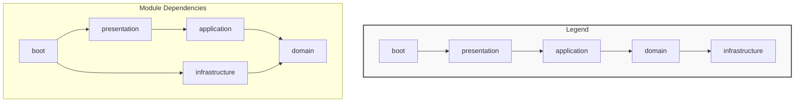

# 認証基盤（auth コンテキスト）設計まとめ

本ドキュメントは、`com.myou.ec.ecsite` プロジェクトにおける  
**AP基盤（認証基盤：auth コンテキスト）** のクラス構成・役割を、現在の実装に合わせて整理したドキュメントです。

---

## 1. 全体構成

### 1.1 Gradle モジュール構成

プロジェクトは DDD のレイヤに対応した **5層のGradleマルチモジュール構成** を採用しています。

- `domain`          … ドメインモデル／ビジネスルール（Policy）／Repository インタフェース
- `application`     … ユースケース／AP基盤 sharedService（業務から利用される入口）
- `infrastructure`  … DB／MyBatisなど外部技術依存の実装
- `presentation`    … Controller／View／Spring SecurityのWeb層部品
- `boot`            … Spring Boot 起動クラス／DIコンテナ設定／全体コンフィギュレーション

### 1.2 パッケージ命名規約

ルートパッケージ：

```text
com.myou.ec.ecsite
````

モジュールとコンテキストを組み合わせてパッケージを構成します。

```text
com.myou.ec.ecsite.<layer>.<context>...
```

- **Layer**: `boot` / `presentation` / `application` / `domain` / `infrastructure`
- **Context**: `auth`（認証基盤）, `account`（業務側アカウント管理）など

本ドキュメントでは **auth コンテキスト（AP基盤）** にフォーカスします。

---

## 2. モジュール依存関係



- `domain`: 他モジュールに依存しない中核。
- `application`: `domain` に依存。
- `infrastructure`: `domain` に依存。
- `presentation`: `application` に依存。
- `boot`: `presentation` と `infrastructure`、および設定対象の全モジュールに依存し、アプリケーション全体を統合します。

---

## 3. auth コンテキストのパッケージ構成

### 3.1 domain モジュール（認証ドメイン）

認証ドメインの核となるビジネスルールとデータ構造を定義します。

パス: `domain/src/main/java/com/myou/ec/ecsite/domain/auth`

```text
com.myou.ec.ecsite.domain.auth
 ├─ exception/         … 認証ドメイン固有の業務例外
 │   ├─ AccountLockedException
 │   ├─ PasswordPolicyViolationException
 │   └─ ...
 ├─ model/             … Entity, ValueObject
 │   ├─ AuthAccount              … 認証アカウント（Entity）
 │   ├─ AuthRole                 … ロール（Entity）
 │   ├─ LoginHistory             … ログイン履歴（Entity）
 │   ├─ AccountLockEvent         … アカウントロックイベント
 │   ├─ PasswordHistory          … パスワード履歴
 │   ├─ value/
 │   │   ├─ UserId
 │   │   ├─ PasswordHash
 │   │   └─ ...
 │   └─ ...
 ├─ policy/            … ドメインルール・ポリシー
 │   ├─ LockPolicy               … アカウントロックに関するポリシー
 │   │  └─ FixedThresholdLockPolicy
 │   ├─ PasswordPolicy           … パスワードの構文や有効期限に関するポリシー
 │   │  └─ CompositePasswordPolicy
 │   ├─ AccountExpiryPolicy      … アカウントの有効期限に関するポリシー
 │   └─ ...
 └─ repository/        … Repositoryインタフェース
     ├─ AuthAccountRepository
     ├─ AuthRoleRepository
     ├─ AuthLoginHistoryRepository
     ├─ AuthAccountLockHistoryRepository
     ├─ AuthPasswordHistoryRepository
     └─ ...
```

> **ポイント**
>
> - 認証に関する複雑なビジネスルール（パスワードポリシー、ロック条件など）は、旧来の `DomainService` ではなく、`policy` パッケージ配下の各ポリシークラスにカプセル化されています。
> - `application` 層はこれらの `policy` を組み合わせて利用します。

### 3.2 application モジュール（AP基盤 sharedService）

業務アプリケーション層や `presentation` 層に、認証機能のユースケースを **sharedService** として提供します。

パス: `application/src/main/java/com/myou/ec/ecsite/application/auth`

```text
com.myou.ec.ecsite.application.auth
 ├─ dto/                 … 画面や他サービスとのデータ転送オブジェクト
 │   ├─ AuthAccountDetailDto
 │   └─ AuthAccountSearchParam
 ├─ provider/            … 現在の操作者情報を提供するインタフェース
 │   └─ CurrentUserProvider
 ├─ repository/          … 検索ユースケース専用のRepositoryインタフェース
 │   └─ AuthAccountQueryRepository
 └─ sharedservice/       … 外部に公開するユースケース実装
     ├─ AuthAccountAdminSharedService  … 管理者向けアカウント操作
     ├─ AuthAccountContextSharedService… ログイン中ユーザー情報取得
     ├─ AuthAccountQuerySharedService  … アカウント情報の検索
     ├─ PasswordChangeSharedService    … パスワード変更
     ├─ LoginProcessSharedService      … ログイン成功/失敗時のコア処理
     └─ AccountExpirySharedService     … アカウント有効期限関連の処理
```

### 3.3 infrastructure モジュール（リポジトリ実装）

`domain` 層の Repository インタフェースを、MyBatis を用いて永続化します。

パス: `infrastructure/src/main/java/com/myou/ec/ecsite/infrastructure/auth`

```text
com.myou.ec.ecsite.infrastructure.auth
 ├─ mapper/              … MyBatis Mapperインタフェース（Java）
 │   ├─ AuthAccountMapper
 │   └─ ...
 ├─ record/              … DBテーブルに対応するRecordクラス
 │   ├─ AuthAccountRecord
 │   └─ ...
 └─ repository/          … Repositoryインタフェースの実装クラス
     ├─ AuthAccountRepositoryImpl
     ├─ AuthAccountQueryRepositoryImpl
     └─ ...

// MyBatisのSQLは `resources` フォルダに配置
// resources/com/myou/ec/ecsite/infrastructure/auth/mapper/AuthAccountMapper.xml
```

### 3.4 presentation モジュール（Web層）

Spring MVC の Controller や、Spring Security の Web 関連のコンポーネントを配置します。

パス: `presentation/src/main/java/com/myou/ec/ecsite/presentation`

```text
com.myou.ec.ecsite.presentation
 ├─ controller/          … 画面遷移やリクエストを処理するController
 │   ├─ LoginController
 │   ├─ PasswordChangeController
 │   └─ ...
 ├─ form/                … 画面からの入力値をバインドするFormクラス
 │   └─ PasswordChangeForm
 ├─ auth/security/       … Spring Security 関連のコンポーネント
 │   ├─ userdetails/
 │   │   ├─ AuthAccountDetails         … Spring Security の UserDetails 実装
 │   │   └─ AuthAccountDetailsService  … UserDetails をロードするサービス
 │   ├─ handler/
 │   │   ├─ AuthAuthenticationSuccessHandler  … 認証成功ハンドラ
 │   │   └─ AuthAuthenticationFailureHandler  … 認証失敗ハンドラ
 │   ├─ event/
 │   │   ├─ AuthenticationSuccessEventListener … 認証成功イベントリスナ
 │   │   └─ AuthenticationFailureEventListener … 認証失敗イベントリスナ
 │   ├─ provider/
 │   │   └─ SpringSecurityCurrentUserProvider … `CurrentUserProvider` の実装
 │   └─ interceptor/
 │       └─ PasswordChangeRequiredInterceptor  … パスワード変更強制用インターセプタ
 └─ ...
```

### 3.5 boot モジュール（アプリケーション起動と設定）

アプリケーション全体を起動し、DIコンテナや各種設定を統合します。

パス: `boot/src/main/java/com/myou/ec/ecsite`

```text
com.myou.ec.ecsite
 ├─ EcSiteApplication.java   … @SpringBootApplication を持つ起動クラス
 └─ config/                  … アプリケーション全体のコンフィギュレーション
     ├─ SpringSecurityConfig.java  … Spring Security の全体設定（URLアクセス制御など）
     ├─ ApplicationConfig.java     … Bean定義など
     └─ ...
```

---

## 4. 主なユースケースと責務分担

### 4.1 ログイン成功時

1.  **Spring Security**: ユーザー名とパスワードの認証が成功。
2.  `AuthAuthenticationSuccessHandler`: `AuthenticationSuccessEvent` を発行。
3.  `AuthenticationSuccessEventListener`: イベントをリッスン。
4.  `LoginProcessSharedService`: 呼び出される。
    - `AuthLoginHistoryRepository` を通じて `SUCCESS` 履歴を登録。
    - `AccountExpiryPolicy` などでパスワード有効期限切れなどを判定。
    - 最終的に `/menu` またはパスワード変更画面 `/account/passwordChange` へのリダイレクト先を決定。

### 4.2 ログイン失敗時

1.  **Spring Security**: 認証が失敗。
2.  `AuthAuthenticationFailureHandler`: `AuthenticationFailureBadCredentialsEvent` などを発行。
3.  `AuthenticationFailureEventListener`: イベントをリッスン。
4.  `LoginProcessSharedService`: 呼び出される。
    - `AuthLoginHistoryRepository` を通じて `FAIL` 履歴を登録。
    - `LockPolicy` を使用して連続失敗回数をチェックし、閾値を超えた場合はロックイベントを登録。
    - `/login?error` へリダイレクト。

### 4.3 パスワード変更（ユーザー自身）

1.  **`PasswordChangeController`**: `/account/passwordChange` へのPOSTリクエストを受理。
2.  `PasswordChangeSharedService`: Controllerから呼び出される。
3.  **`PasswordChangeSharedService` 内**:
    - `PasswordPolicy` を使ってパスワードのルール（構文、履歴）を検証。
    - `AuthAccountRepository` を使ってパスワードハッシュを更新。
    - `AuthPasswordHistoryRepository` を使って新しいパスワードの履歴を登録。

---

## 5. まとめ

- **5層のモジュール構成** (`boot`, `presentation`, `application`, `domain`, `infrastructure`) になりました。
- 認証ロジックの中心は `domain` 層の **`policy`** パッケージに集約されています。
- `application` 層は **`sharedService`** として、具体的なユースケースを外部に提供します。
- ログイン成功/失敗のようなイベント駆動の処理は、`presentation` 層の **イベントリスナー** が起点となり、`application` 層の `LoginProcessSharedService` に処理を委譲します。
- アプリケーション全体の起動と設定は **`boot`** モジュールが責務を持ちます。

この構成により、各層の責務がより明確になり、メンテナンス性と拡張性が向上しています。
