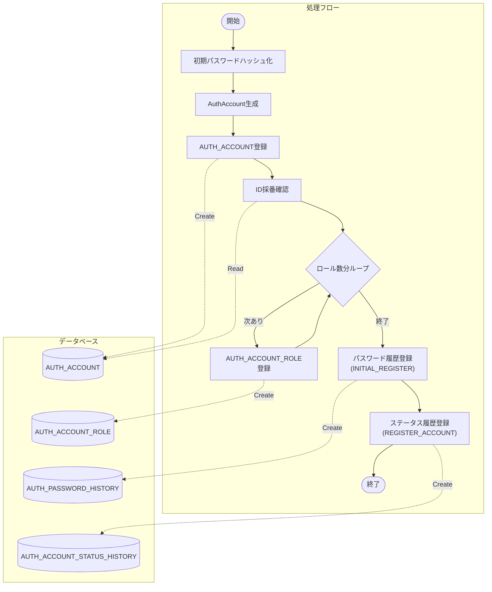
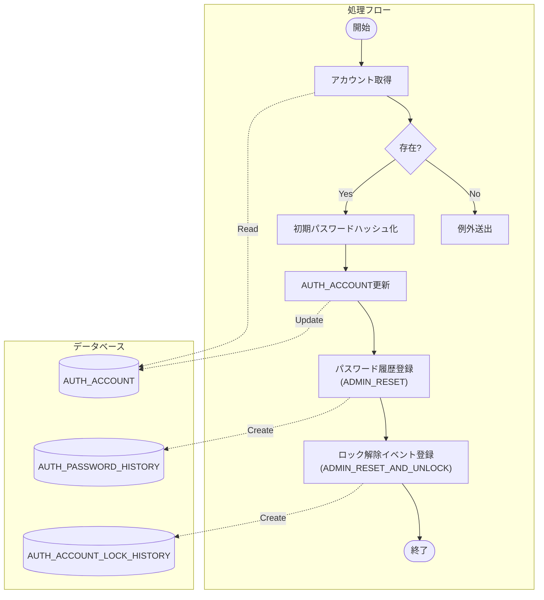
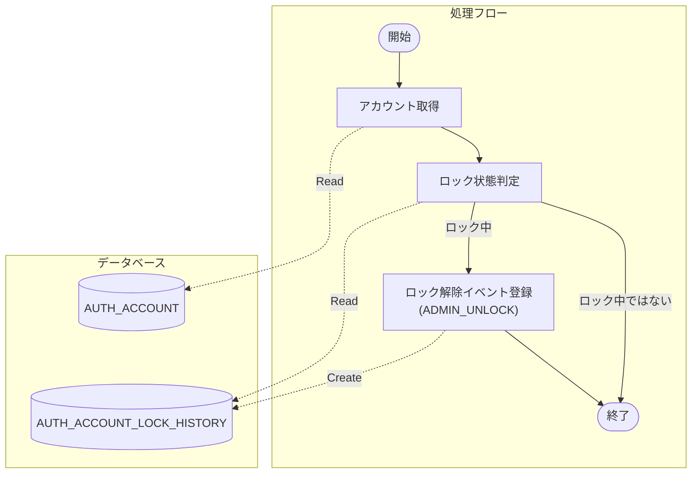
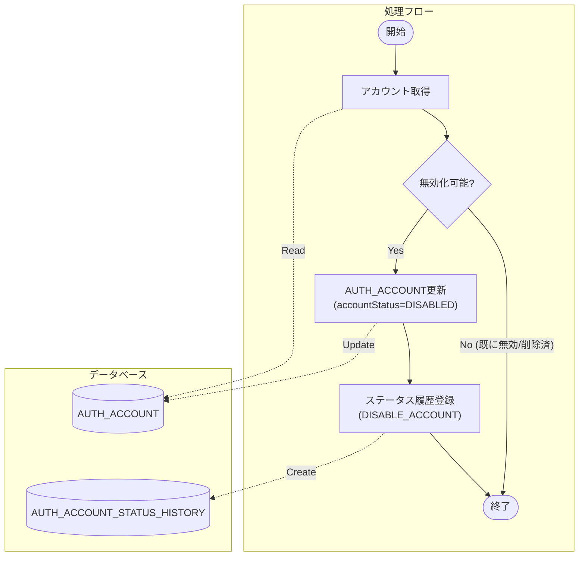
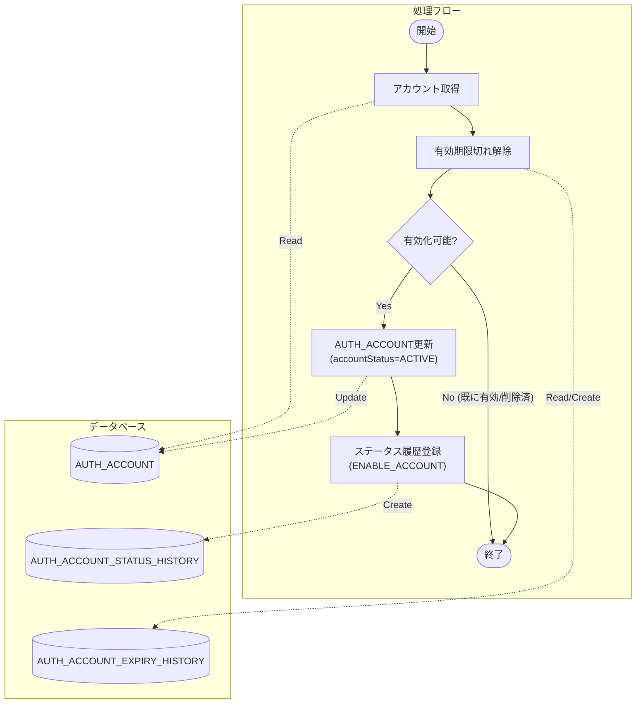
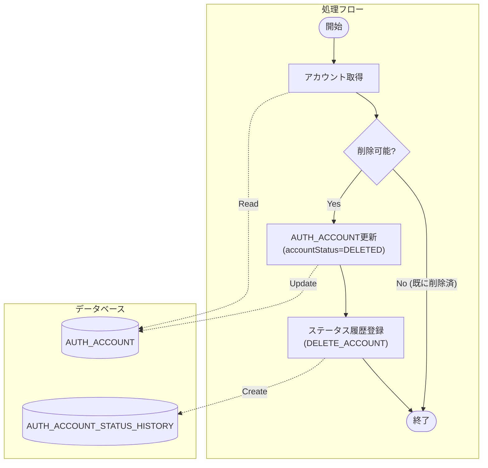

# アカウント管理 (AuthAccountAdminSharedService)

## 概要
管理者によるアカウントのライフサイクル管理（登録、パスワードリセット、ロック解除、有効化/無効化、削除）を提供する SharedService。

## メソッド一覧

1.  [registerAccount](#1-registeraccount) - アカウント新規登録
2.  [resetPassword](#2-resetpassword) - パスワードリセット
3.  [unlockAccount](#3-unlockaccount) - アカウントロック解除
4.  [disableAccount](#4-disableaccount) - アカウント無効化
5.  [enableAccount](#5-enableaccount) - アカウント有効化
6.  [deleteAccount](#6-deleteaccount) - アカウント論理削除

---

## 1. registerAccount

### 概要
新しいアカウントを作成し、初期パスワードとロールを設定する。

### シグネチャ
`AuthAccountId registerAccount(String newLoginId, Set<RoleCode> roleCodes)`

### 処理フロー

### 詳細仕様
1.  **初期パスワード生成**: 設定値 `auth.initial-password` (デフォルト: `password123`) をハッシュ化する。
2.  **アカウント保存**: `AUTH_ACCOUNT` に新規レコードを登録する。
3.  **ロール付与**: 引数で指定されたロール一覧を `AUTH_ACCOUNT_ROLE` に登録する。
4.  **パスワード履歴登録**: `AUTH_PASSWORD_HISTORY` に変更種別 `INITIAL_REGISTER` で履歴を登録する。
5.  **ステータス履歴登録**: `AUTH_ACCOUNT_STATUS_HISTORY` に理由 `REGISTER_ACCOUNT` で履歴を登録する。

---

## 2. resetPassword

### 概要
指定されたアカウントのパスワードを初期パスワードにリセットし、同時にロックも解除する。

### シグネチャ
`void resetPassword(AuthAccountId targetAccountId)`

### 処理フロー

### 詳細仕様
1.  **アカウント取得**: 対象アカウントが存在しない場合は例外とする。
2.  **パスワード更新**: 初期パスワードのハッシュ値で `AUTH_ACCOUNT` を更新する。
3.  **パスワード履歴登録**: `AUTH_PASSWORD_HISTORY` に変更種別 `ADMIN_RESET` で履歴を登録する。
4.  **ロック解除**: `AUTH_ACCOUNT_LOCK_HISTORY` に `UNLOCK` イベントを登録する（パスワード初期化時はロックも解除する仕様のため）。

---

## 3. unlockAccount

### 概要
ロック状態のアカウントを強制的にロック解除する。

### シグネチャ
`void unlockAccount(AuthAccountId targetAccountId)`

### 処理フロー

### 詳細仕様
1.  **アカウント取得**: 対象アカウントが存在しない場合は例外とする。
2.  **ロック状態判定**: 直近のロック履歴から現在ロック中か判定する。ロック中でなければ処理を終了する（イベント重複防止）。
3.  **ロック解除**: `AUTH_ACCOUNT_LOCK_HISTORY` に `UNLOCK` イベントを登録する。

---

## 4. disableAccount

### 概要
アカウントを無効化（ログイン不可）する。

### シグネチャ
`void disableAccount(AuthAccountId targetAccountId)`

### 処理フロー

### 詳細仕様
1.  **アカウント取得**: 対象アカウントが存在しない場合は例外とする。
2.  **状態チェック**: 既に無効化されている、または削除済みの場合は処理を終了する。
3.  **アカウント更新**: `AUTH_ACCOUNT.account_status` を `DISABLED` に更新する。
4.  **ステータス履歴登録**: `AUTH_ACCOUNT_STATUS_HISTORY` に理由 `DISABLE_ACCOUNT` で履歴を登録する。

---

## 5. enableAccount

### 概要
無効化されたアカウントを有効化する。有効期限切れの場合は期限切れ解除も行う。

### シグネチャ
`void enableAccount(AuthAccountId targetAccountId)`

### 処理フロー

### 詳細仕様
1.  **アカウント取得**: 対象アカウントが存在しない場合は例外とする。
2.  **有効期限切れ解除**: `AccountExpirySharedService.unexpireIfExpired` を呼び出し、期限切れ状態であれば解除履歴を登録する。
3.  **状態チェック**: 既に有効、または削除済みの場合は処理を終了する。
4.  **アカウント更新**: `AUTH_ACCOUNT.account_status` を `ACTIVE` に更新する。
5.  **ステータス履歴登録**: `AUTH_ACCOUNT_STATUS_HISTORY` に理由 `ENABLE_ACCOUNT` で履歴を登録する。

---

## 6. deleteAccount

### 概要
アカウントを論理削除する。

### シグネチャ
`void deleteAccount(AuthAccountId targetAccountId)`

### 処理フロー

### 詳細仕様
1.  **アカウント取得**: 対象アカウントが存在しない場合は例外とする。
2.  **状態チェック**: 既に削除済みの場合は処理を終了する。
3.  **アカウント更新**: `AUTH_ACCOUNT.account_status` を `DELETED` に更新する。
    *   ※ `AUTH_ACCOUNT` テーブルには `deleted` カラムや `enabled` カラムは存在せず、`account_status` カラムで状態管理を行っている。
4.  **ステータス履歴登録**: `AUTH_ACCOUNT_STATUS_HISTORY` に理由 `DELETE_ACCOUNT` で履歴を登録する。
