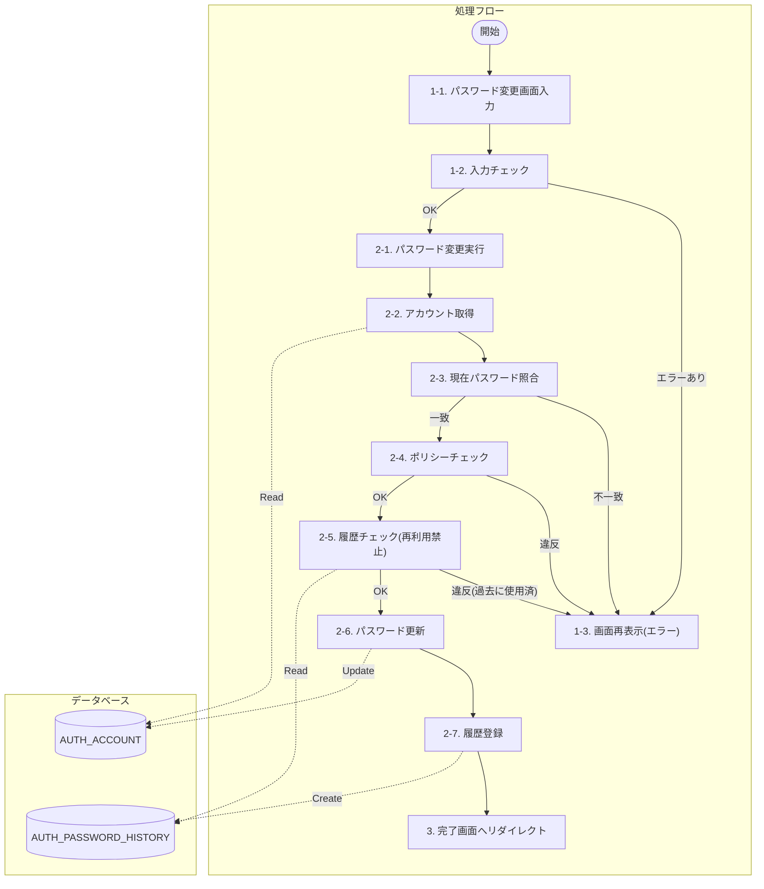
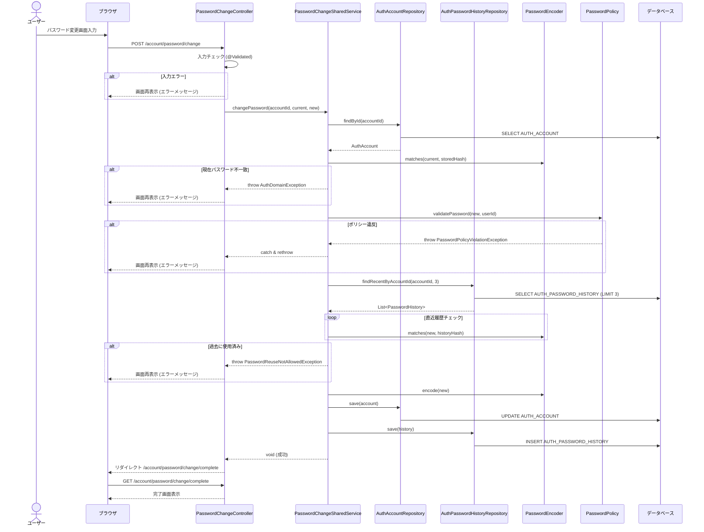

# パスワード変更処理

## 概要
ログイン中のユーザーが自身のパスワードを変更する処理。
現在のパスワードによる認証、新パスワードのポリシーチェック、履歴による再利用禁止チェックを行った上で、パスワードを更新する。

## 処理フロー

### フローチャート
※各ステップの番号は、後述の「詳細仕様」の項番に対応しています。
※実線矢印（ラベルなし）は処理フロー、点線矢印（ラベルあり：Read/Create/Update）はデータアクセスを表します。

### シーケンス図

## 詳細仕様

### 1. 入力・検証処理

#### 1-1. パスワード変更画面入力
*   **URL**: `/account/password/change` (POST)
*   **パラメータ**:
    *   `currentPassword`: 現在のパスワード
    *   `newPassword`: 新しいパスワード

#### 1-2. 入力チェック
*   **アノテーション検証**: `@Validated` により、必須入力などの基本的なチェックを行う。
*   **相関チェック**: 必要に応じて、新パスワードと確認用パスワードの一致確認などを行う（現状の実装ではフォームクラス側で実施想定）。

#### 1-3. 画面再表示(エラー)
*   入力エラーや後続の業務エラーが発生した場合、エラーメッセージを設定して変更画面を再表示する。

### 2. パスワード変更実行 (SharedService)

#### 2-1. パスワード変更実行
*   `PasswordChangeSharedService.changePassword` を呼び出す。

#### 2-2. アカウント取得
*   `AuthAccountRepository` を使用して、対象アカウントの情報を取得する。

#### 2-3. 現在パスワード照合
*   入力された `currentPassword` と、DBに保存されているハッシュ値を `PasswordEncoder` で照合する。
*   不一致の場合は `AuthDomainException` をスローする。

#### 2-4. ポリシーチェック
*   `PasswordPolicy.validatePassword` を呼び出し、新パスワードがポリシー（桁数、文字種、IDとの類似性など）を満たしているか検証する。
*   違反している場合は例外をスローする。

#### 2-5. 履歴チェック(再利用禁止)
*   `AuthPasswordHistoryRepository` から直近3世代のパスワード履歴を取得する。
*   新パスワードが履歴に含まれるパスワードと一致しないか `PasswordEncoder` で確認する。
*   一致する場合は `PasswordReuseNotAllowedException` をスローする。

#### 2-6. パスワード更新
*   新パスワードをハッシュ化し、アカウント情報のパスワードを更新する。
*   `AuthAccountRepository.save` で `AUTH_ACCOUNT` テーブルを更新する。

#### 2-7. 履歴登録
*   変更履歴（`USER_CHANGE`）を作成し、`AuthPasswordHistoryRepository.save` で `AUTH_PASSWORD_HISTORY` テーブルに登録する。

### 3. 完了処理
*   処理が正常に完了した場合、完了画面 (`/account/password/change/complete`) へリダイレクトする。
*   リダイレクト時にフラッシュ属性 (`RedirectAttributes`) を用いて成功メッセージを表示する。

## 関連クラス
*   `PasswordChangeController`
*   `PasswordChangeSharedService` (Impl)
*   `AuthAccountRepository`
*   `AuthPasswordHistoryRepository`
*   `PasswordPolicy`
*   `PasswordEncoder`
