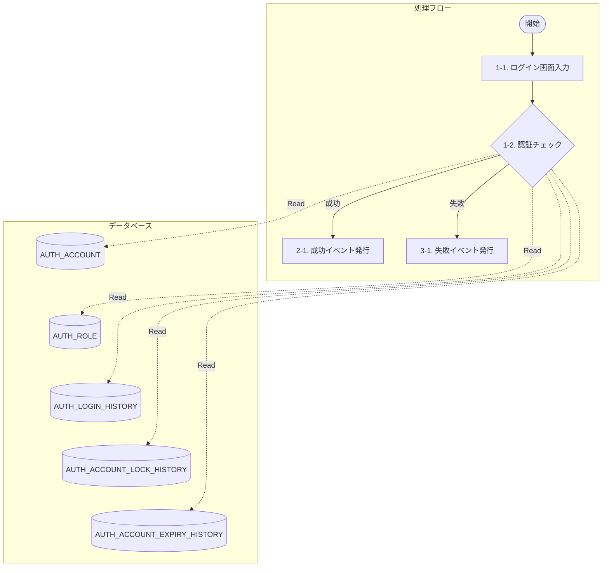
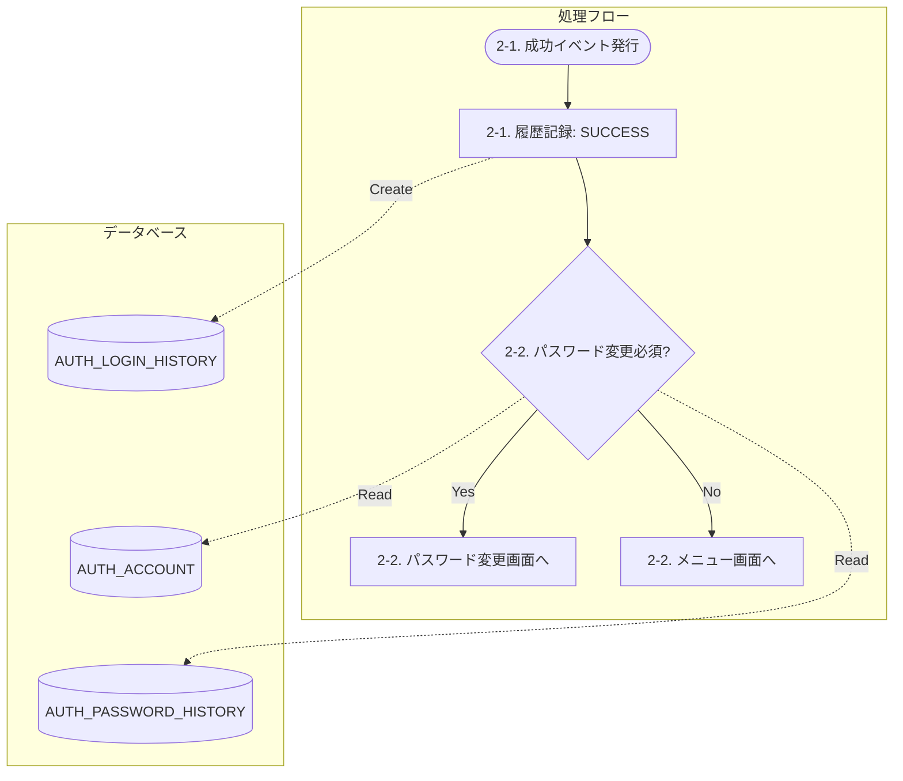
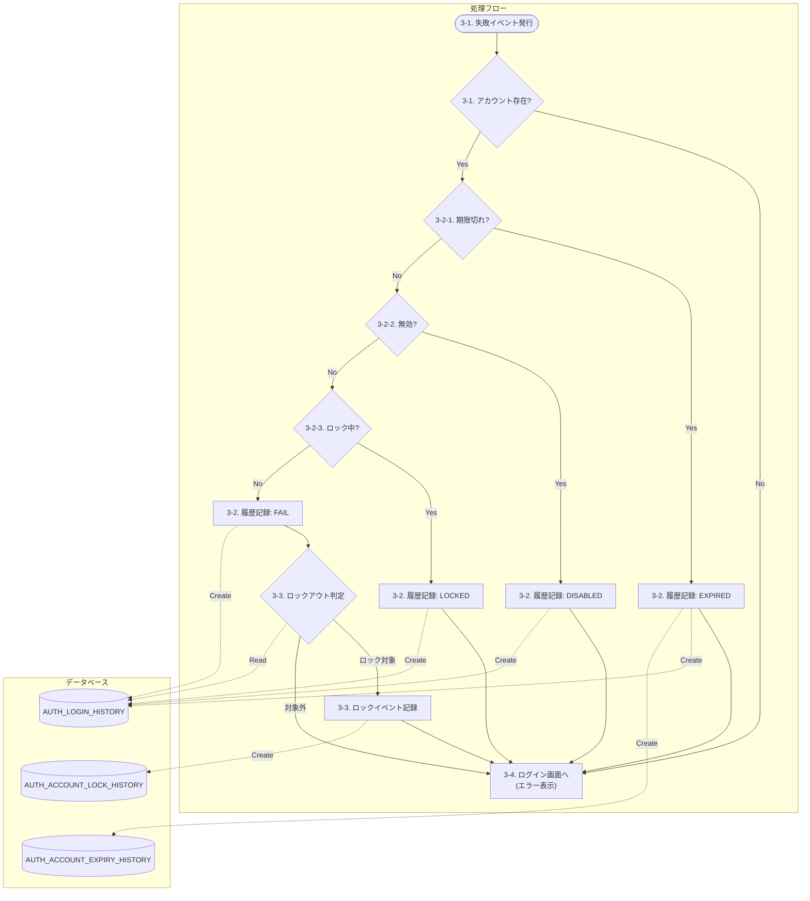
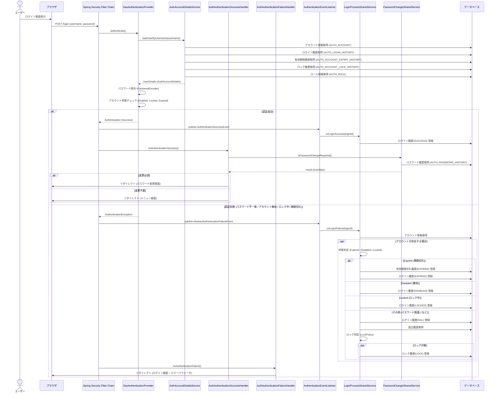

# ログイン認証処理

## 概要
ログイン画面から入力されたユーザーIDとパスワードを用いて認証を行い、結果に応じた処理（画面遷移、履歴記録、ロック制御など）を行う。

## 処理フロー

### フローチャート

#### 1. 認証プロセス (認証チェックまで)
ログイン入力から認証プロバイダによるチェック、イベント発行までのフロー。

#### 2. 認証成功時の処理
認証成功イベントを受け取り、履歴記録とパスワード変更チェックを行うフロー。

#### 3. 認証失敗時の処理
認証失敗イベントを受け取り、アカウント状態に応じた履歴記録とロックアウト制御を行うフロー。

### シーケンス図

## 詳細仕様

### 1. 認証処理 (Spring Security)

#### 1-1. ログイン画面入力
*   **URL**: `/login` (POST)
*   **パラメータ**:
    *   `username`: ユーザーID
    *   `password`: パスワード

#### 1-2. 認証チェック
*   **認証プロバイダ**: `DaoAuthenticationProvider` を使用。
*   **ユーザー情報取得**: `AuthAccountDetailsService` にてDBからアカウント情報を取得し、`AuthAccountDetails` を生成する。
    *   `AuthAccountDetails` には、アカウントの有効状態、ロック状態、パスワード期限切れ状態、前回ログイン日時などが含まれる。
    *   **アカウント情報**: `AUTH_ACCOUNT` テーブルから取得。
    *   **前回ログイン日時**: `AUTH_LOGIN_HISTORY` テーブルから最新の成功履歴を取得。
    *   **有効期限切れ**: `AccountExpirySharedService` を利用して判定（`AUTH_ACCOUNT_EXPIRY_HISTORY` を参照）。
    *   **ロック状態**: `AUTH_ACCOUNT_LOCK_HISTORY` テーブルの履歴から判定する。
    *   **権限（ロール）**: `AUTH_ROLE` テーブルから取得。
*   **検証**: パスワード照合、およびアカウント状態（有効/ロック/期限切れ）のチェックを行う。

### 2. 認証成功時の処理

#### 2-1. 成功イベント発行・履歴記録
*   **イベントリスナー**: `AuthenticationSuccessEventListener` が `AuthenticationSuccessEvent` を検知。
*   **ドメイン処理**: `LoginProcessSharedService.onLoginSuccess(loginId)` を実行。
    *   `AUTH_LOGIN_HISTORY` テーブルに `SUCCESS` の履歴を登録する。

#### 2-2. パスワード変更必須チェック・画面遷移
*   **ハンドラ**: `AuthAuthenticationSuccessHandler` が実行される。
    *   `PasswordChangeSharedService.requirementOf()` を呼び出し、パスワード変更が必要か判定する。
    *   **判定ロジック**:
        *   `AUTH_ACCOUNT` からユーザ情報を取得。
        *   `AUTH_PASSWORD_HISTORY` から最新のパスワード履歴を取得。
        *   履歴が存在しない場合（初期登録）、または変更種別が `ADMIN_RESET`（管理者リセット）の場合、または `USER_CHANGE` だが有効期限切れの場合に変更必須と判定する。
    *   **変更が必要な場合**: パスワード変更画面 (`/.well-known/change-password`) へリダイレクト。
    *   **変更不要な場合**: デフォルトの遷移先（メニュー画面など）へリダイレクト。

### 3. 認証失敗時の処理

#### 3-1. 失敗イベント発行・アカウント存在チェック
*   **イベントリスナー**: `AuthenticationFailureEventListener` が `AbstractAuthenticationFailureEvent` を検知。
*   **ドメイン処理**: `LoginProcessSharedService.onLoginFailure(loginId)` を実行。
    *   入力された `loginId` に該当するアカウントが存在しない場合は、セキュリティ保護のため履歴を残さず終了する。

#### 3-2. 状態判定・履歴記録
*   アカウントが存在する場合、以下の優先順位で状態を判定し、対応する履歴を `AUTH_LOGIN_HISTORY` に登録する。
    1.  **期限切れ (Expired)**: `accountExpirySharedService.isExpired()` が true の場合。
        *   履歴種別: `EXPIRED`
        *   `AUTH_ACCOUNT_EXPIRY_HISTORY` にも期限切れイベントを登録する。
    2.  **無効 (Disabled)**: `user.canLogin()` が false の場合。
        *   履歴種別: `DISABLED`
    3.  **ロック中 (Locked)**: `lockHistoryRepository` でロック状態と判定された場合。
        *   履歴種別: `LOCKED` (失敗回数にはカウントしない)
    4.  **その他 (パスワード間違い)**: 上記いずれにも該当しない場合。
        *   履歴種別: `FAIL`

#### 3-3. ロックアウト判定・ロックイベント記録
*   履歴が `FAIL` の場合、直近のログイン履歴を取得し、`LockPolicy` に基づいてロックアウト判定を行う。
    *   ロックアウト条件（例: 連続6回失敗）を満たした場合、`AUTH_ACCOUNT_LOCK_HISTORY` に `LOCK` イベントを登録する。

#### 3-4. エラー画面遷移
*   **ハンドラ**: `AuthAuthenticationFailureHandler` が実行される。
    *   発生した例外 (`AccountExpiredException`, `LockedException`, `DisabledException` 等) に応じてエラーキーを決定する。
    *   ログイン画面 (`/login`) にエラーキーをパラメータとして付与してリダイレクトする（例: `/login?error=locked`）。

## 関連クラス
*   `AuthAccountDetailsService`
*   `AuthAuthenticationSuccessHandler`
*   `AuthAuthenticationFailureHandler`
*   `AuthenticationSuccessEventListener`
*   `AuthenticationFailureEventListener`
*   `LoginProcessSharedService` (Impl)
*   `PasswordChangeSharedService` (Impl)
*   `AuthAccountDetails`
