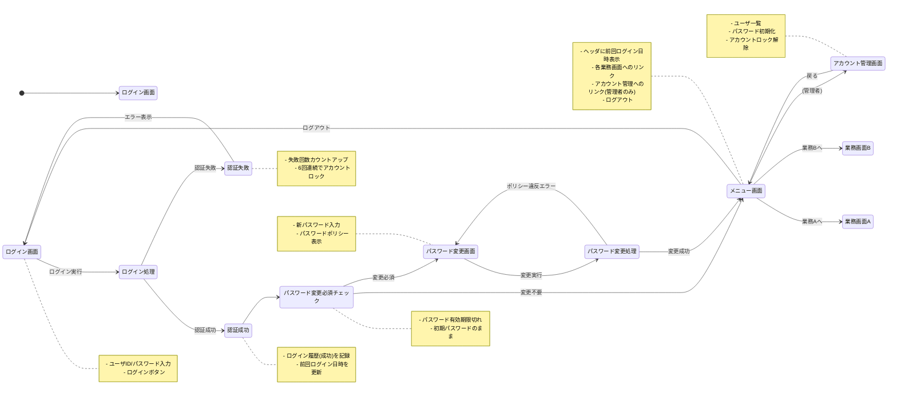

# 認証・認可機能 画面遷移図

```mermaid
stateDiagram-v2
    direction LR
    [*] --> ログイン画面
    state "ログイン画面" as Login
    note right of Login
        - ユーザID/パスワード入力
        - ログインボタン
    end note
    Login --> AuthProcess: ログイン実行
    state "ログイン処理" as AuthProcess
    AuthProcess --> AuthSuccess: 認証成功
    AuthProcess --> AuthFailure: 認証失敗
    state "認証失敗" as AuthFailure
    note right of AuthFailure
        - 失敗回数カウントアップ
        - 6回連続でアカウントロック
    end note
    AuthFailure --> Login: エラー表示
    state "認証成功" as AuthSuccess
    note right of AuthSuccess
        - ログイン履歴(成功)を記録
        - 前回ログイン日時を更新
    end note
    AuthSuccess --> PwdChangeCheck
    state "パスワード変更必須チェック" as PwdChangeCheck
    note right of PwdChangeCheck
        - パスワード有効期限切れ
        - 初期パスワードのまま
    end note
    PwdChangeCheck --> Menu: 変更不要
    PwdChangeCheck --> PwdChange: 変更必須
    state "パスワード変更画面" as PwdChange
    note left of PwdChange
        - 新パスワード入力
        - パスワードポリシー表示
    end note
    PwdChange --> PwdChangeProcess: 変更実行
    state "パスワード変更処理" as PwdChangeProcess
    PwdChangeProcess --> PwdChange: ポリシー違反エラー
    PwdChangeProcess --> Menu: 変更成功
    state "メニュー画面" as Menu
    note left of Menu
        - ヘッダに前回ログイン日時表示
        - 各業務画面へのリンク
        - アカウント管理へのリンク(管理者のみ)
        - ログアウト
    end note
    Menu --> BizScreenA: 業務Aへ
    Menu --> BizScreenB: 業務Bへ
    Menu --> AccountMgmt: (管理者)
    Menu --> Login: ログアウト
    state "アカウント管理画面" as AccountMgmt
    note left of AccountMgmt
        - ユーザ一覧
        - パスワード初期化
        - アカウントロック解除
    end note
    AccountMgmt --> Menu: 戻る
    state "業務画面A" as BizScreenA
    state "業務画面B" as BizScreenB
```
